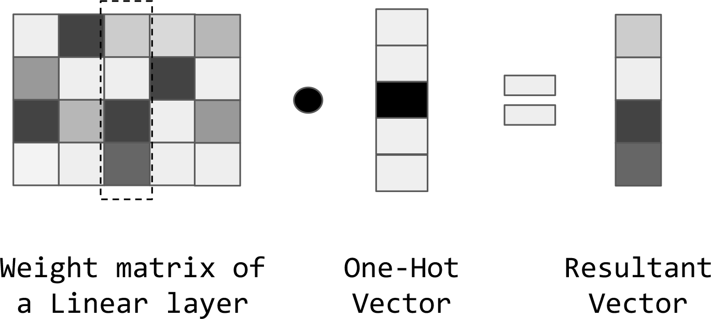

# 第五章   单词和类型的嵌入
 &ensp; &ensp; &ensp; &ensp;在实现自然语言处理任务时，我们需要处理不同类型的离散类型，最明显的例子是单词：单词来自一个有限的集合(即词汇表)。其他离散类型的例子包括字符、词性标记、命名实体、命名实体类型、解析特征、产品目录中的项，等等。本质上，当任何输入特征来自一个有限集(或可数无限集)时，它就是一个离散类型。

&ensp; &ensp; &ensp; &ensp;将离散类型(如单词)表示为密集向量是NLP中深度学习成功的核心，“表征学习”和“嵌入”是指从一种映射中学习这种映射，当离散类型是单词时，这种嵌入被称为密集向量。我们在第二章中看到了基于计数的嵌入方法的例子，比如词频反文档词频 (TF-IDF) 等基于学习或基于预测( Baroni 等人，2014)的嵌入方法
表征（Representation）是通过最大化一个特定学习任务的目标来学习的，例如，根据上下文预测单词。基于学习的嵌入方法由于其广泛的适用性和性能，目前在法律上是合法的。事实上，单词嵌入在NLP任务中的普遍性为它们赢得了“NLP的调料”的称号，因为您可以在任何NLP任务中使用单词嵌入，并期望该任务的性能得到改进。但我们认为这个绰号是误导，因为与调料不同，嵌入通常不是作为事后添加到模型中的，而是模型本身的基本组成部分。

&ensp; &ensp; &ensp; &ensp;在本章中，我们将讨论与单词嵌入有关的矢量表示：嵌入单词的方法，优化有监督和无监督语言任务的单词嵌入的方法，可视化单词嵌入的方法，以及组合单词嵌入句子和文档的方法。但是，您必须记住，我们在此描述的方法适用于任何离散类型。

## 为什么学习嵌入?

&ensp; &ensp; &ensp; &ensp;在前面的章节中，您看到了用于创建单词的矢量表示的传统方法。具体来说，您了解到可以使用onehot表示 - 与词汇大小相同的向量，并且除了具有值1的单个位置代表特定单词之外，其他地方都有0。此外，您还可以看到计数表示 - 矢量的长度与模型中唯一字的数量相同，但在矢量中的位置对应于句子中单词的频率。基于计数的表示也称为分布表示，因为它们的重要内容或含义由向量中的多个维度表示。分布式表示具有悠久的历史（Firth，1935），并且适用于许多机器学习和神经网络模型。这些表示不是从数据中学习而是从启发式构建的
 
&ensp; &ensp; &ensp; &ensp;分布式表示从这样的事实中获得他们的名字，这些单词现在由更低维度的密集向量表示（比如d = 100，而不是整个词汇表的大小，可以是大约105到106或更高），以及意味着一个词的其他属性分布在这个密集向量的不同维度上。

&ensp; &ensp; &ensp; &ensp;与我们在前几章中看到的基于单向和基于计数的向量相比，低维学习密集表示具有多个优点。首先，降低维度在计算上是有效的。其次，基于计数的表示导致高维向量，其沿着许多维度冗余地编码类似信息，并且不共享统计强度。第三，输入中的非常高的维度可能导致机器学习和优化中的实际问题 - 这种现象通常被称为维数的概念。传统上，为了处理这个维度问题，采用了维数减少方法，如奇异值分解（SVD）和主成分分析（PCA），但有些讽刺的是，当维数在数百万的数量级时，这些方法不能很好地扩展（典型的） NLP中的案例）。第四，从任务特定数据中学习（或微调）的表示对于手头的任务是最佳的。使用像TFIDF这样的启发式或像SVD这样的低维方法，不清楚嵌入方法的优化目标是否与任务相关。

## 嵌入的效率

为了理解嵌入是如何工作的，让我们看一个独热向量乘法的例子
线性层中的权矩阵，如图 5-1所示。在第3章和第4章中，一个热向量的大小与词汇表的大小相同
表示特定单词存在的索引。
 

图 5-1 *使用单一编码矢量和线性层的权重矩阵的矩阵乘法的示例。 因为单动向量全部为0且单个为1，所以单个1的放置将充当矩阵乘法中的选择器。 使用权重矩阵和合成矢量中的阴影图案可视地显示这一点。 尽管是功能性的，但这种查找方法在计算上是昂贵且低效的，因为单向量向量乘以权重矩阵中的每个数并计算每行的总和。*

根据定义，接受一个热向量作为输入的线性层的权值矩阵的行数必须与这个热向量的大小相同
乘法，如igure 5-1所示，得到的向量实际上只是选择了非零项所表示的行，根据这个观察，我们可以跳过乘法步骤，代之以直接使用整数作为检索所选行的索引。
关于嵌入效率的最后一点注意事项:尽管igure 5-1中的示例显示了a
权矩阵的维数与输入的单热向量相同，但情况并非总是如此。事实上，与使用单热向量或基于计数的表示相比，嵌入式通常用于在低维空间中表示单词。研究文献中嵌入的典型尺寸从25维到500维不等，精确的选择可以煮沸
直到您必须空闲的GPU内存数量。

## 学习单词嵌入的方法

&ensp; &ensp; &ensp; &ensp; 本章的目标不是教授特定的单词嵌入技术，而是帮助您了解嵌入的内容，嵌入的方式和位置，如何在模型中可靠地使用它们以及它们的局限性。我们这样做的选择是因为从业者很少发现自己需要编写新的嵌入式训练算法。但是，在本节中，我们简要概述了当前训练单词嵌入的方法。所有单词嵌入方法仅用单词（即，未标记的数据）训练，但是以受监督的方式训练。这可以通过构建辅助监督任务来实现，其中数据被隐式标记，其直觉是优化以解决辅助任务的表示将捕获文本语料库的许多统计和语言属性以便通常有用。以下是此类辅助任务的一些示例：

+ 给定一系列单词，预测下一个单词。这也称为语言建模任务。
+ 给定前后的一系列单词，预测缺失的单词。
+ 给定一个单词，预测窗口内发生的单词，与位置无关。

当然，这个列表并不完整，辅助任务的选择取决于算法设计者的直觉和计算费用。例子包括GloVe，Continuous Bag-of-Words（CBOW），Skipgrams等。有关详细信息，请参阅Goldberg，2017年第10章，但我们将简要介绍CBOW模型。但是，对于大多数用途，使用预训练的单词嵌入并对其进行微调就足够了。

### 预习词嵌入的实际应用

&ensp; &ensp; &ensp; &ensp; 本章的大部分内容以及本书后面的内容都涉及使用预训练的单词嵌入。 使用前面描述的众多方法之一，可以自由下载和使用预训练的大型语料库（如Google新闻，维基百科或Common Crawl3）训练的预训练单词嵌入。 本章的其余部分将介绍如何有效地加载和查找这些嵌入，检查单词嵌入的一些属性，并提供在NLP任务中使用预训练嵌入的一些示例。

### 加载嵌入

&ensp; &ensp; &ensp; &ensp;词嵌入已经变得很流行和普及，你可以下载许多不同的种类词嵌入方法，从最初的Word2Vec到斯坦福的GLoVe，Facebook的FastText和许多其他。 通常，嵌入将采用以下格式：每行以嵌入的单词/类型开始，后面跟着一系列数字（即向量表示）。 该序列的长度是表示的维度（也称为嵌入维度）。 嵌入维度通常为数百个。 令牌类型的数量通常是词汇表的大小，大约是一百万。 例如，以下是来自GloVe的狗和猫矢量的前七个维度：

狗  ­­­0.360 0.573 0.367 0.600 1.242 0.189 -1.273…

猫  ­­­0.610 0.674 0.351 0.413 0.964 0.212 -1.380…

&ensp; &ensp; &ensp; &ensp;为了有效地加载和处理嵌入，我们描述了一个名为PreTrainedEmbeddings的实用程序类（例5-1）。 该类构建了所有单词向量的内存索引，以便使用叫annoy的近似最近邻包来促进快速查找和最近邻查询。

*示例5-1 .使用预先训练好的单词嵌入*

| Input[0] | ---- |
| ---- | ---- |
| Input[0] | ---- |

在这些例子中，我们使用手套词embedded。下载它们之后，可以使用PretrainedEmbeddings类进行实例化，如例5-1中的第二个输入所示。
### 单词嵌入之间的关系

词嵌入的核心特征是编码的句法语义关系
表现为用词的规律性。例如，猫和狗被谈论的方式非常相似(关于宠物的讨论，喂养等等)，因此，它们的嵌入距离非常近
它们比其他动物，如鸭子和大象，更重要。
我们可以通过几种方式来探索嵌入词编码的语义关系。最流行的方法之一是类比任务(SAT等考试中推理任务的一个流行类别):
单词1:单词2::单词3:______
在这个任务中，您将看到前三个单词，需要确定第四个单词
与前两个词之间的关系一致。首先，我们从Word1中减去Word2>，这个差分向量对这个关系进行编码
在Word1和Word2之间，这个差值可以加到Word3中，从而得到一个向量
接近第四个单词，其中空白符号为。使用这个结果向量对索引执行最近邻查询可以解决类比问题。计算这个的函数，如xample 5-2所示，
正如刚才所描述的:使用向量算法和近似的最近邻索引，它完成了类比。
示例5-2 .使用单词嵌入的类比任务

输入[0]导入numpy为np
从恼人的进口烦恼指数
类PreTrainedEmbeddings(对象):
实现继续从之前的代码示例"" def get_embed (self, word): "
”“”
参数:
词(str)返回
一个嵌入(numpy.ndarray)”“”
返回self.word_vectors[自我。word_to_index[词]]def get_closest_to_vector(自我,向量,n = 1):
”““给定一个向量,返回n最近的邻国参数:
向量(np.ndarray):应该匹配向量惹恼指数的大小
n(int):返回的邻居数量的回报:
(str,str,…:话说最近的给定的向量的话不是下令距离
”“”
输入[0]
nn_indices = self.index.get_nns_by_vector(向量,n)返回(self.index_to_word(邻居)
对于nn_indexes中的邻居]
def compute_and_print_类推(self, word1, word2, word3):
”““打印解决方案来类比词嵌入的类比是word1 word2 word3是__
该方法将打印:word1 word2::word3:word4
参数:
(str)word1 word2(str)word3(str)”“”
vec1 = self.get_embedding(word1)vec2 = self.get_embedding(word2)vec3 = self.get_embedding(word3)
#简单的假设:类比是一种空间关系spatial_relationship = vec2­vec1
vec4 = vec3 + spatial_relationship
closest_words = self.get_closest_to_vector组(vec4,n = 4)existing_words =((word1 word2,word3])
closest_words =(逐字closest_words
如果单词不在existing_words]如果len(closest_words)= = 0:
打印(“找不到最近的邻居的向量!”)回来
        
closest_words中的单词4:
打印(“{ }:{ }:{ }:{ }“.format(word1 word2,word3,

E
word4))
有趣的是，简单的单词类比任务可以演示单词嵌入捕获各种语义和语法关系，如xample 5-3所示。
例子5­3。单词嵌入编码了许多语言学关系，如SAT类比任务所示
输入[0]#关系1:有性别的名词与代名词之间的关系
mbeddings.compute_and_print_analogy(‘人’,‘他’,‘女人’)
输出[0]男人:他::女人:她
输入[1]#关系2:动名词关系
embeddings.compute_and_print_analogy(“飞”、“飞机”、“帆”)
输出[1]:fly:: plane:: sail: ship
输入[2]#关系3:名词-名词关系
embeddings.compute_and_print_analogy(“猫”,“小猫”,“狗”)
输出[2]猫:小猫::狗:小狗
输入[3]#关系4:Hypernymy(更广泛的类别)
embeddings.compute_and_print_analogy(“蓝”、“颜色”、“狗”)
输出[3]蓝色:颜色::狗:动物
输入[4]#关系5:Meronymy (part-to-whole)
embeddings.compute_and_print_analogy(“脚”、“足”,“手指”)
输出[4]脚趾:脚::手指:手
输入[5]#关系6:肌钙蛋白(方式不同)
embeddings.compute_and_print_analogy(“交谈”,“沟通”,“读”)
输出:[5]talk:: communication:: read: interpretation
输入[6]#关系7:转喻(惯例/修辞)
embeddings.compute_and_print_analogy(“蓝”、“民主党人”,“红”)

E
 

输出[6]蓝色:民主党::红色:共和党输入[7]#关系8:形容词量表
embeddings.compute_and_print_analogy(“快”,“最快”、“年轻的”)
输出[7]快速:最快:年轻:年轻
尽管看起来这些关系是系统地关系到语言的功能，但是事物可以得到
棘手。正如xample 5-4所示，因为单词向量仅仅基于共现，所以关系可能是错误的。
例子5­4。一个例子说明了使用共现来编码意义的危险——有时它们不是!
输入[0]embed . compute_and_print_类推('fast'， 'fast'， 'small')输出[0]fast: faster:: small: large
xample 5-5演示了最常见的类比对之一是如何编码带有性别的角色。示例5-5 .注意在嵌入词中编码的受保护属性，如性别。这可能会在下游模型中引入不必要的偏差。
输入[0]嵌入。compute_and_print_类推('man'， 'king'， 'woman')输出[0]man: king:: woman: queen
事实证明，区分语言规则和文化偏见是很困难的。
例如，医生并不是事实上的男人，护士也不是事实上的女人，但是这些长期存在于文化中的偏见在语言中被观察到是有规律的，并被编入vector这个词中，as
如xample 5-6所示。
例5-6 .向量类比中编码的文化性别偏见
输入[0]嵌入，compute_and_print_类推('man'， 'doctor'， 'woman')输出[0]man: doctor:: woman: nurse
考虑到嵌入式在NLP中的流行和使用，您需要了解嵌入式中的偏见
申请人数在上升。去偏现有的词嵌入是一个新的和令人兴奋的研究领域(见Bolukbasi et al.， 2016)。此外，我们建议您访问thicsinnlp.org，获取伦理和NLP交叉的最新结果。
例子:学习连续的单词嵌入

在本例中，我们将介绍最著名的模型之一，该模型用于构建和学习
通用嵌入词，Word2Vec连续词袋(CBOW)模型。在
在这一节中，当我们提到“CBOW任务”或“CBOW分类任务”时，隐含的意思是我们构建分类任务的目的是为了学习CBOW嵌入。CBOW模型是一个多类分类任务，通过扫描文本中的单词来表示，创建一个
上下文窗口，从上下文窗口中删除中心单词，并对
上下文窗口。直观地说，您可以将其视为填空任务。有一个句子缺少一个单词，模型的工作是找出这个单词应该是什么。
6

本例的目标是引入nn. embedded layer，这是一个PyTorch模块
封装嵌入矩阵。使用嵌入层，我们可以将令牌的整数ID映射到神经网络计算中使用的向量
权值为了使损失最小化，它还更新了向量的值。通过这个过程，模型将学习以最有效的方式嵌入单词。
在本例的其余部分中，我们遵循标准的示例格式
介绍数据集，玛丽雪莱的科学怪人。然后，我们讨论了从令牌到向量化小批处理的向量化管道
使用嵌入层。接下来，我们将介绍训练例程(如果您已经连续阅读了本书，那么此时的训练应该相当熟悉)。最后，我们将讨论模型
评估，模型推理，以及如何检查模型。
弗兰肯斯坦数据集

对于这个例子，我们将从玛丽·雪莱小说的数字化版本构建一个文本数据集
弗兰肯斯坦，可通过roject Gutenberg找到。本节将介绍如何为这个文本数据集创建一个PyTorch数据集类，并最终将数据集分割为训练数据集，
验证和测试集。
从Project Gutenberg分发的原始文本文件开始，预处理非常简单:我们使用LTK的Punkt tokenizer将文本分割成单独的句子，然后将每个句子转换为
小写和标点符号被完全删除。这种预处理允许我们稍后在空格上拆分字符串，以检索令牌列表

“F E
举个例子:餐厅评论的情绪分类。
下一步是将数据集枚举为窗口序列，这样CBOW模型就可以
优化。为此，我们遍历每个句子中的令牌列表，并将它们分组到指定窗口大小的窗口中，如igure 5-2中所示。7
 
图5-2 . CBOW任务:使用左右两个上下文预测一个单词
两边的长度都是2。在文本上滑动窗口会产生许多“监督”示例，每个示例都有其目标单词(在中间)
第三，鉴于上下文“i pitied”和“my pity”，CBOW分类器被设置为预测“frankenstein”。
构建数据集的最后一步是将数据分为三个集合:训练集、验证集和测试集
用于更新参数，验证集用于度量模型的性能。
测试集最多使用一次，以提供偏差较小的度量
在本书中的例子中)，我们使用了70%的训练集、15%的验证集和15%的测试集。
8

窗口和目标的结果数据集使用panda DataFrame加载，并在CBOWDataset类中建立索引。xample 5-7展示了__getitem__()代码片段，该代码片段利用矢量化器将上下文(左窗口和右窗口)转换为矢量
窗口中心的单词使用词汇表转换为整数。示例5-7 .为CBOW任务构造一个数据集类
类CBOWDataset(数据):
#……现有的实现来自xample 3-15 @classmethod
cbow_csv def load_dataset_and_make_vectorizer(cls):
”““加载数据集,使一个新的vectorizer从零开始
参数:
cbow_csv(str):数据集返回的位置:
的一个实例CBOWDataset”“”
cbow_df = pd.read_csv(cbow_csv)
train_cbow_df = cbow_df(cbow_df.split = =‘火车’)
返回cls(cbow_df CBOWVectorizer.from_dataframe(train_cbow_df)def __getitem__(自我,指数):
”““PyTorch数据集的主要入口点的方法
参数:
指数(int):索引数据点的回报:
dict类型与特性(x_data)和标签(y_target)

" S E " c)
”“”
行= self._target_df。iloc[index] context_vector = \
self._vectorizer.vectorize(row.context self._max_seq_length)
target_index = self._vectorizer.cbow_vocab.lookup_token(row.target)返回{ x_data:context_vector,
“y_target”:target_index }
词汇表、向量化器和数据阅读器

在CBOW分类任务中，从文本到矢量化小批处理的管道主要是标准的:
词汇表和DataLoader的功能与它们在示例中所做的完全相同:对餐馆评论的名称进行分类”。然而，与我们在第3章和第4章中看到的矢量化器不同，在这种情况下，矢量化器并不构建一个热向量，而是一个整数向量
表示上下文的索引被构造并返回。xample 5-8给出了vectorize()函数的代码。
示例5-8 . CBOW数据的矢量化器
类CBOWVectorizer(对象):
协调词汇表并将其用于使用的矢量化器(def vectorize(self, context, vector_length= -1):
”“”
参数:
上下文(str):词用空格分隔的字符串
vector_length(int):一个理由迫使指数的长度已经”“”
指数= \
[self.cbow_vocab.lookup_token(令牌)上下文令牌。如果vector_length < 0:
vector_length = len(指数)
out_vector = np.zeros(vector_length dtype = np.int64)out_vector[:len(指数)]=指数
out_vector len(指标):= self.cbow_vocab。mask_index返回out_vector
请注意，如果上下文中的令牌数量小于最大长度，那么其余的条目都用0填充。
CBOWClassifier模型

xample 5-9中显示的CBOWClassifier有三个基本步骤。首先，将表示上下文单词的索引与嵌入层一起使用，以为其中的每个单词创建向量
第二，我们的目标是以某种方式组合这些向量，使其能够捕捉整体
在这个例子中，我们对向量求和。然而，其他的选择包括取最大值，平均值，甚至在顶部使用多层感知器
线性层来计算预测向量。这个预测向量是整个词汇表的概率分布，预测向量中最大(最可能)的值表示可能
预测目标词——上下文中缺少的中心词。
这里使用的嵌入层主要由两个数字参数化
嵌入(词汇表的大小)和嵌入(嵌入维度)的大小。在xample 5-9: padding_idx中的代码片段中使用了第三个参数
对于像我们这样数据点长度可能不相同的情况，为嵌入层设置一个值。该层强制对应于该索引的向量及其梯度为所有
0年代。
9

示例5-9 . CBOWClassifier模型
类CBOWClassifier(nn.Module):
def __init__(自我、vocabulary_size embedding_size padding_idx = 0):“”
参数:
vocabulary_size(int):词汇的数量,控制嵌入的数量和预测矢量的大小
embedding_size(int):嵌入的大小
padding_idx(int):默认0;那将不会使用这个索引”“”
超级(CBOWClassifier自我). __init__()
self.embedding = nn。嵌入(num_embeddings = vocabulary_size embedding_dim = embedding_size,
padding_idx = padding_idx)self.fc1 = nn.Linear(in_features = embedding_size,
out_features = vocabulary_size)def向前(自我、x_in apply_softmax = False):
””“分类器的前进传球
参数:
张量x_in(torch.Tensor):一个输入数据
input_dim x_in.shape应该(批处理)
apply_softmax(bool):将softmax激活的标志
应该是假的,如果使用十字架­熵损失的回报:
结果tensor. tensor.shape应该(批处理,output_dim)。”“”
x_embedded_sum = self.embedding(x_in).sum(暗= 1)y_out = self.fc1(x_embedded_sum)
        
如果apply_softmax:
y_out = F.softmax(y_out昏暗= 1)
返回y_out
培训程序

在这个例子中，训练程序遵循我们在整本书中使用的标准。
初始化数据集、矢量化器、模型、损失函数和优化器。然后，对数据集的训练和验证部分进行一定次数的迭代，优化训练部分的损失最小化，并测量验证部分的进度
训练常规，我们建议你参考例子:分类情绪的餐厅评论”，其中我们涵盖了它的很大细节。xample 5-10展示了我们用于培训的参数。示例5-10 . CBOW训练脚本的参数
输入[0]args =命名空间(
数据和路径信息
数据/书/ frankenstein_with_splits cbow_csv = "。csv”,vectorizer_file = " vectorizer.json”,
model_state_file = " model.pth ",
save_dir="model_storage/ch5/cbow"， # Model超参数
embedding_size = 300,
训练超参数seed=1337，
num_epochs = 100,
batch_size learning_rate = 0.001,= 128,
early_stopping_criteria = 5,
为空格省略了运行时选项)

模型评估与预测

本例中的评估基于从提供的单词上下文预测测试集中每个目标和上下文对的目标单词。一个正确分类的单词意味着模型是
在本例中，模型实现了15%的目标词
测试集的分类准确率不高，原因有以下几点:
本例中CBOW的构造是为了说明如何构造通用嵌入
第二，我们使用的数据集是minuscucul -一本包含大致内容的书
在从头开始训练时，7万字的数据不足以识别许多规律。相比之下，最先进的嵌入式通常是在具有tb级文本的数据集上进行训练的。
0

1

在这个例子中，我们展示了如何使用PyTorch nn。通过设置一个名为CBOW分类的人工监督任务，来从头开始训练嵌入
在机器学习中，使用在一个任务上训练的模型作为另一个任务的初始化器
任务叫做转移学习。
示例:使用预先训练的嵌入进行文档分类的转移学习

前面的例子使用了一个嵌入层来做简单的分类。这个例子以三种方式为基础:首先加载预先训练好的单词嵌入，然后对这些预先训练的单词进行微调
通过对整篇新闻文章进行分类，最后利用卷积神经网络来捕捉单词之间的空间关系。
在这个例子中，我们使用了AG News数据集
引入词汇表类SequenceVocabulary的一个变体，以捆绑对序列建模至关重要的几个令牌。

“C A E C。
在描述了数据集以及如何构建向量化的小批处理之后，我们逐步将预先训练好的单词向量加载到嵌入层中，并演示它们是如何构建的
根据我们的设置进行定制。然后，该模型将训练好的嵌入层与CNN结合起来，例如:使用CNN对姓氏进行分类。为了将模型的复杂性扩展到更实际的构造中，我们还确定了使用dropout作为a的位置
正规化技术。然后我们讨论训练程序。您可能不会感到惊讶，这与之前在hapter 4和本章中的示例相比几乎没有什么变化
通过对测试集上的模型进行评估并讨论结果来总结示例。
AG新闻数据集

G新闻数据集是由2005年收集的100多万篇新闻文章组成的
用于实验数据挖掘和信息提取方法的学者。这个例子的目的是说明预先训练的单词嵌入在文本分类中的有效性。在这个例子中，我们使用一个精简的版本，其中包含12万篇平均分配的新闻文章
在四个类别之间:体育、科学/技术、世界和商业。除了精简数据集之外，我们还将重点放在文章标题上，并创建multiclass
根据标题预测类别的分类任务。
和以前一样，我们通过删除标点符号、在文本周围添加空格来对文本进行预处理
标点符号(如逗号、撇号和句号)，并将文本转换为小写。此外，我们将数据集分割为训练、验证和测试集，方法是首先按类标签聚合数据点，然后将每个数据点分配给这三个分割中的一个。这样，类分布在各个分支上就保证是相同的。
在xample 5-11中显示的NewsDataset.__getitem__()方法遵循一个相当基本的方法
您现在应该熟悉的公式是:表示模型输入的字符串是从数据集中的特定行检索的，由Vectorizer向量化，并与整数配对
表示新闻类别(类标签)。
示例5-11 . NewsDataset.__getitem__()方法
小姑娘NewsDataset(集):@classmethod
news_csv def load_dataset_and_make_vectorizer(cls):
”““加载数据集,使一个新的vectorizer从零开始
参数:
news_csv(str):数据集返回的位置:
的一个实例NewsDataset”“”
news_df = pd.read_csv(news_csv)
train_news_df = news_df(news_df.split = =‘火车’)
返回cls(news_df NewsVectorizer.from_dataframe(train_news_df)def __getitem__(自我,指数):
”““PyTorch数据集的主要入口点的方法
参数:
指数(int):索引数据点的回报:
dict控股数据点的特性(x_data)和标签(y_targe”“”
行= self._target_df。iloc[index] title_vector = \
self._vectorizer.vectorize(row.title self._max_seq_length)category_index = \
self._vectorizer.category_vocab.lookup_token(row.category)返回{ x_data:title_vector,
“y_target”:category_index }
ocabulary, Vectorizer和DataLoader

在这个示例中，我们将介绍SequenceVocabulary，它是标准词汇表类的一个子类，它捆绑了用于序列数据的四个特殊标记:UNK标记、MASK标记和
序列开始令牌和序列结束令牌。我们将在hapter 6中更详细地描述这些令牌，但简而言之，它们有三个不同的用途。我们在hapter 4中看到的UNK token (unknown的缩写)允许模型学习罕见单词的表示
它可以容纳在测试时从未见过的单词。当序列长度可变时，掩码令牌充当嵌入层和损失计算的哨兵。最后，序列开始和序列结束标记给神经网络关于的提示
序列的边界。igure 5-3显示了在更广泛的向量化管道中使用这些特殊标记的结果。
 
图5­3。矢量化管道的一个简单示例以最基本的SequenceVocabulary开始，它包含文本中描述的四个特殊标记。
因为单词“Jerry”不在sequence evocabulary中，所以它被映射到<UNK>整数
标记句子边界的特殊标记放在前面并附加到整数中。最后，整数右填充0到特定的长度，这允许数据集中的每个向量都是相同的长度。
文本到矢量化的迷你批处理管道的第二部分是矢量化器，它实例化和封装了SequenceVocabulary的使用
Vectorizer遵循我们在Vectorizer中演示的模式，即通过按一定频率计数和阈值限制词汇表中允许的单词总数
这个动作的目的是通过去除噪声、低频的单词来提高模型的信号质量，限制内存模型的内存使用。
实例化后，Vectorizer的vectorize()方法接受新闻标题和作为输入
返回与数据集中最长标题相同长的向量。它有两个关键行为。首先，它在本地存储最大序列长度，通常，数据集跟踪最大序列长度

E 1
序列长度，在推理时，将测试序列的长度作为向量的长度，但由于我们有CNN模型，即使在
推理时间。第二个关键行为，如xample 5-11中的代码片段所示，是输出一个零填充的整数向量，它表示序列中的单词
的整数中，序列开始令牌的前缀为整数，序列结束令牌的后缀为整数。从分类器的角度来看，
这些特殊的标记提供了序列边界的证据，允许它对边界附近的单词和中心附近的单词作出不同的反应。2
示例5-12 .为AG新闻数据集实现矢量化器
类NewsVectorizer(对象):
def vectorize(自我、标题、vector_length =­1):“”
参数:
标题(str):词用空格分开的字符串
vector_length(int):力量指数向量的长度的回报:
矢量化标题(numpy.array)”“”
指数=[self.title_vocab.begin_seq_index]
在title.split indices.extend(self.title_vocab.lookup_token(令牌)令牌(" "))
indices.append(self.title_vocab.end_seq_index)如果vector_length < 0:
vector_length = len(指数)
out_vector = np.zeros(vector_length dtype = np.int64)out_vector[:len(指数)]=指数
out_vector len(指标):= self.title_vocab。mask_index返回out_vector
@classmethod
def from_dataframe(cls, news_df, cutoff=25):
”“”从数据集dataframe vectorizer实例化
参数:
news_df(pandas.DataFrame):目标数据集
截止(int):包括词汇频率阈值的回报:
的一个实例NewsVectorizer”“”
category_vocab =词汇表()
类别的排序(设置(news_df.category)):category_vocab.add_token(类别)
word_counts =计数器()
对于news_df.title中的标题:
对于title.split(" ")中的token:
如果token不在字符串中。标点符号:word_counts[标记]+ = 1
        
title_vocab = SequenceVocabulary()
词,word_count word_counts.items():如果word_count > =截止:
title_vocab.add_token(单词)
返回cls(title_vocab category_vocab)

E
NewsClassifier模型

在本章的早些时候，我们展示了如何从磁盘上加载预先训练好的嵌入式数据，并使用Spotify的烦人库中的最近邻数据结构高效地使用它们
在这个例子中，我们将向量相互比较以发现有趣的语言学见解。然而，预训练的词向量有一个更有效的用途:我们可以使用它们来初始化嵌入层的嵌入矩阵。
使用单词嵌入作为初始嵌入矩阵的过程包括首先从磁盘加载单词嵌入，然后为单词选择正确的嵌入子集
实际呈现在数据中，最后将嵌入层的权值矩阵设置为加载的
子集。第一步和第二步在xample 5-13中演示。一个经常出现的问题是数据集中的单词的存在，但是没有包含在预先训练的手套嵌入中。
处理这种情况的一种常见方法是使用PyTorch库中的初始化方法，如xample 5-13所示的Xavier均匀方法(Glorot and Bengio, 2010)。
示例5-13 .根据词汇表选择单词嵌入的子集
“”加载手套嵌入
    
参数:
手套glove_filepath (str):路径嵌入的文件返回:
word_to_index(东西),嵌入(numpy.ndarray)”“”
word_to_index ={}嵌入= []
张开(glove_filepath,“r”)作为外交政策:指数,在列举(fp):
行= line.split(" ") #每一行:词num1 num2……word_to_index[行[0]][0]=指数#字=行
embedding_i = np.array((float(val)val一致[1:]])embeddings.append(embedding_i)
返回word_to_index np.stack(嵌入)
def make_embedding_matrix(glove_filepath的话):
为一组特定的单词创建嵌入矩阵。    
参数:
手套glove_filepath (str):文件路径嵌入的单词(列表):单词列表的数据集
返回:
final_embeddings(numpy.ndarray):嵌入矩阵”“”
word_to_idx, glove_embed = load_glove_from_file(glove_filepath) embed _size = glove_embed .shape[1]
final_embeddings = np.zeros ((len(单词),embedding_size))对我来说,在列举(词):
if word in word_to_idx:
final_embeddings [i:] = glove_embeddings [word_to_idx[词]]:
embedding_size embedding_i = torch.ones (1) torch.nn.init.xavier_uniform_ (embedding_i)
final_embeddings [i:] = embedding_i final_embeddings返回
本例中的新闻分类器基于第4-4节中的ConvNet分类器，其中
我们使用CNN对姓氏进行分类，只对一个热门的嵌入字符进行分类。具体地说，我们使用嵌入层，它将输入标记索引映射到向量表示
将嵌入层的权矩阵替换为预训练的嵌入子集，如图所示
以5­14。然后在forward()方法中使用嵌入将索引映射到向量，除了嵌入层之外，所有的东西都与in中的例子完全相同
3.

例如:使用CNN对姓氏进行分类。示例5-14 .实现新闻分类器
小姑娘NewsClassifier (nn.Module):
def __init__(自我、embedding_size num_embeddings、num_channels hidden_dim, num_classes, dropout_p,
pretrained_embeddings = None,padding_idx = 0):“”
参数:
embedding_size(int):嵌入向量的大小num_embeddings(int):嵌入向量的数量
filter_width (int):卷积内核的宽度
num_channels (int):每层hidden_dim卷积内核数量(int):隐藏的维度的大小
num_classes(int):类的数量分类dropout_p(浮动):一个辍学参数
pretrained_embeddings (numpy.array):以前训练单词embeddi默认是没有。如果提供,
padding_idx (int):索引代表一个空位置”“”
超级(NewsClassifier自我). __init__()如果pretrained_embeddings没有:
self.emb = nn.Embedding (embedding_dim = embedding_size,
num_embeddings = num_embeddings,
padding_idx = padding_idx)其他:
pretrained_embeddings = torch.from_numpy(pretrained_embeddings).floa self.emb = nn.Embedding(embedding_dim = embedding_size,
num_embeddings = num_embeddings padding_idx = padding_idx,
_weight = pretrained_embeddings)
            
self.convnet = nn.Sequential(
nn.Conv1d (in_channels = embedding_size,
out_channels = num_channels kernel_size = 3), nn.ELU (),
神经网络。Conv1d (in_channels = num_channels out_channels = num_channels kernel_size = 3,跨步= 2),
nn.ELU (),
神经网络。Conv1d (in_channels = num_channels out_channels = num_channels kernel_size = 3,跨步= 2),
nn.ELU (),
神经网络。Conv1d (in_channels = num_channels out_channels = num_channels kernel_size = 3),
nn.ELU ())
self._dropout_p = dropout_p
self.fc1 = nn.Linear (num_channels hidden_dim) self.fc2 = nn.Linear (hidden_dim num_classes)
def向前(自我、x_in apply_softmax = False):“”“分类器的前进传球
        
参数:
张量x_in (torch.Tensor):一个输入数据
dataset._max_seq_length x_in.shape应该(批)apply_softmax(bool):将softmax激活的标志
应该是假的,如果使用十字架­熵损失的回报:
结果tensor. tensor.shape应该(批处理,num_classes)。”“”
#嵌入和交换功能是渠道x_embedded = self.emb (x_in) .permute(0 2 1)特性= self.convnet (x_embedded)
#平均和删除额外的维度remaining_size = features.size(暗= 2)
特点= F.avg_pool1d(特性,remaining_size) .squeeze(暗= 2)特性= F.dropout(特性,p = self._dropout_p)
        
生成分类输出的最后一个线性层
intermediate_vector = F.relu(F.dropout(self.fc1(特性),p = self._dropout_p))
如果apply_softmax prediction_vector = self.fc2(intermediate_vector):
prediction_vector = F.softmax (prediction_vector昏暗= 1)prediction_vector返回
他的例行训练

训练例程由以下操作序列组成:实例化数据集、实例化模型、实例化丢失函数、实例化优化器、迭代数据集的训练
划分和更新模型参数，迭代数据集的验证分区并测量性能，然后重复数据集的迭代一定次数
序列你们应该很熟悉。本例的超参数和其他训练参数如xample 5-15所示。
示例5-15 .使用预训练嵌入的CNN新闻分类器的参数
args =名称空间(
数据和路径超参数
数据/ ag_news / news_with_splits news_csv = "。csv”,vectorizer_file = " vectorizer.json”,
model_state_file = " model.pth ",
save_dir="model_storage/ch5/document_classification"， # Model hyperparameters
数据/手套/ glove.6B.100d glove_filepath = '。txt”, use_glove = False,
embedding_size = 100, hidden_dim = 100,
num_channels = 100,
训练超参数seed=1337，
learning_rate = 0.001, dropout_p = 0.1,
batch_size = 128,num_epochs = 100,

E
early_stopping_criteria = 5 #运行时选项忽略了空间
)

模型评估与预测

在这个例子中，任务是将新闻标题分类到它们各自的类别中。正如您在前面的示例中所看到的，有两种方法可用于理解模型执行任务的情况:使用测试数据集进行定量评估，以及亲自检查分类结果的定性评估。
对测试数据集进行评估

虽然这是你第一次看到分类新闻标题的任务，定量的
评估例程与之前的所有评估例程相同:将模型设置为eval模式，关闭drop - off和backpropagation(使用classifier.eval())，然后在eval模式下对测试集进行迭代
在一个典型的设置中，你应该尝试不同的方法
培训选项，当您满意时，您应该执行模型评估。我们把它留作练习让你们完成。你们在这个测试集中能得到的最终准确度是多少?请记住，在整个实验过程中只能使用测试集一次。
预测小说新闻标题的类别

训练分类器的目标是将其部署到生产环境中，以便能够执行推理或
对不可见数据的预测。要预测尚未处理的新闻标题的类别，并在数据集中进行预测，有几个步骤
对于推理，我们在输入端使用相同的预处理函数
就像在训练中使用的一样。这个预处理后的字符串使用训练时使用的矢量化器进行矢量化，并转换成PyTorch张量。计算预测向量的最大值以查找类别的名称。xample 5-16给出代码。
例5-16 .训练模型预测
def predict_category(title, classifier, vectorizer, max_length): """预测一个新标题的新闻类别
    
参数:
标题(str):原始标题字符串
分类器(NewsClassifier):训练过的分类器矢量化器(NewsVectorizer)的实例:对应的矢量化器
max_length (int):最大序列长度
注意:cnn对输入数据敏感张量的大小。
这样可以确保它保持相同大小的训练数据。”“”
title = preprocess_text vectorized_title = \(标题)
vector .张量(vectorizer.vectorize(title, vector_length=max_length))结果=分类器(vectorized_title.unsqueeze(0)， apply_softmax=True)
probability ty_values, index = result.max(dim=1)
predicted_category = vectorizer.category_vocab.lookup_index(index .item())返回{'category': predicted_category，
“概率”:probability_values.item()}

总结

在这一章中，我们学习了单词嵌入，这是一种将单词等离散项表示为空间中固定维向量的方法，这样向量之间的距离就可以编码多种类型的
语言特性。重要的是要记住本章介绍的技巧是
适用于任何离散单元，如句子、段落、文档、数据库记录等。这使得嵌入技术对于深度学习是不可或缺的，尤其是在NLP中。我们展示了如何以黑盒方式使用预先训练的嵌入。我们简要讨论了一些直接从数据中学习这些嵌入的方法，包括连续字袋(CBOW)方法。然后我们展示了如何在语言建模的背景下训练CBOW模型
通过一个使用预训练嵌入的例子，探索了文档分类等任务中的微调嵌入。
不幸的是，由于篇幅有限，这一章遗漏了很多重要的主题，例如去偏词嵌入、建模上下文和一词多义。
社会偏见可以通过有偏见的训练语料库编码到模型中。在一项研究中，与“她”最接近的词是家庭主妇、护士、接待员、图书管理员、理发师等等，而与“他”最接近的词是外科医生、门生、哲学家、建筑师、金融家等等。基于这种偏差嵌入的模型可以继续做出可能产生结果的决策
消除词语嵌入的偏见仍然是一个新兴的研究领域
建议您阅读Bolukbasi等人(2016)和最近引用的论文。还要注意，我们使用的单词embedded没有考虑上下文。例如，根据上下文的不同，单词“play”可能有不同的含义，但是这里讨论的所有嵌入方法都会将这些含义折叠起来。
Peters等人(2018)最近的作品探索了基于上下文提供嵌入的方法。

## 参考文献

**为了方便大家查找参考文献，所有参考文献不再翻译**

1.	Firth, John. (1935). “The Technique of Semantics.” Transactions of the Philological Society.

2.	Baroni, Marco, Georgiana Dinu, and Germán Kruszewski. (2014). “Don’t Count, Predict! A Systematic Comparison of Context­Counting vs. Context­Predicting Semantic Vectors.” Proceedings of the 52nd Annual Meeting of the ACL.

3.	Bolukbasi, Tolga, et al. (2016). “Man Is to Computer Programmer as Woman Is to Homemaker? Debiasing Word Embeddings.” NIPS.

4.	Goldberg, Yoav. (2017). Neural Network Methods for Natural Language Processing. Morgan and Claypool.

5.	Peters, Matthew et al. (2018). “Deep Contextualized Word Representations.” arXiv preprint arXiv:1802.05365.

6.	Glorot, Xavier, and Yoshua Bengio. (2010). “Understanding the Difficulty of Training Deep Feedforward Neural Networks.” Proceedings of the 13th International Conference on Artificial Intelligence and Statistics.

